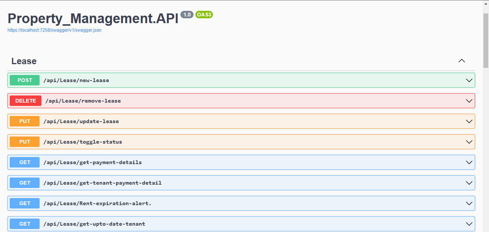
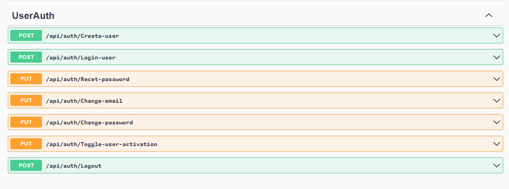
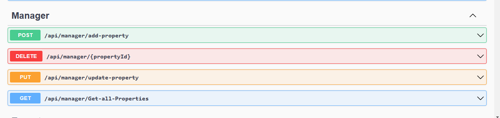
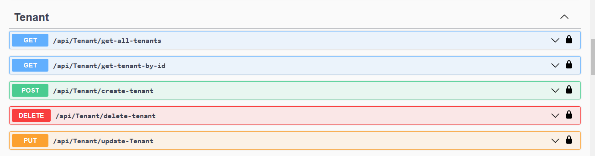
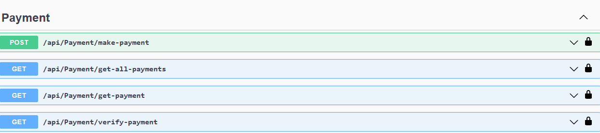

# ASP.NETCore  Property Management API

This is a Property Management API built using ASP.NET Core Web API, EF Core, IUnitOfWork and Irepository, this was to handle seperation of concerns.

## Objective: 

The Property Management API is a SaaS platform that helps property managers and landlords manage their rental properties. The API should provide features for managing leases, collecting rent, handling maintenance requests, and managing tenant data.

## Features

* Property management: The API should allow property managers to manage multiple properties, including adding and removing properties, updating property details, and managing tenant data.


* Lease management: The API should provide tools for managing lease agreements, including creating new leases, renewing leases, and tracking lease details such as rent payments and security deposits.


* Rent collection: The API should allow landlords to collect rent payments online, including automatic payment processing and payment reminders.


* Maintenance requests: The API should provide a system for handling maintenance requests, including creating new requests, tracking the status of requests, and assigning maintenance tasks to staff or contractors.


## Screenshots

|                                                                 |                                                                                         |
|:---------------------------------------------------------------:|:---------------------------------------------------------------------------------------:|
| **Lease**                                                  |                               **Property**                                               |
| [](./images/Lease.png") | [](./images/userAuth.png) |
|  **User Authentication**                                        |                                                 **Tenant**                      |
| [](./images/Manager.png)| [](./images/Tenant.png) | |
| **Payment**           | **Property details**               | |
| [](./images/Payment.png) | [](./documentation/pictures/property.png)| |

 

## Getting started

### Clone the GitHub repository
```shell
$ git clone https://github.com/yourusername/property-management-api.git
```
- Open the solution in Visual Studio.
- locate the `appsettings.json` and supply your connectionString.
- Run the following commands in the Package Manager Console(Tools-> NuGet Package Manager -> Package Manager Console)

```shell 
 Update-Database
```


## Technologies and Libraries
- .NET 6
- ASP.NET Core 6.0
- Swagger UI
- Entity Framework Core
- SQLServer
- AutoMapper
- MicrosoftEntityFramework Tools
- MicrosoftEntityFramework Design
- ASP.NET Core Web API
- ASP.NET Core Identity (SQL Server)
- JWT
- Swagger (Documentation)
- Error Handling Middleware

## Principles and Patterns
- Onion Architecture
- Clean Code
- SOLID Principles
- Separation of Concerns


Features Implemented
====================
Admin-End
--------
- Authentication/Registration
- Adding of Properties
- Reading,Editing/Updating and Deleting of Properties
- Database Migrations and Seeder
- User Creation
- Creating of Leases
- Reading, Editing/Updating  and Deleting of Leases
-  Creating of Tenants
- Reading, Editing/Updating  and Deleting of Tenants


## Approach: 
We followed the code first approach, created Entities, their attributes, established relationships and these entities were migrated to database as tables. 

Below are the entities used:

*	Property table – Consists of details of different buildings in the vicinity or on a street. 

*	Tenant table – consists of details of the unit like unit number, resident id, no of bedrooms, no of washrooms, pet allowed, in unit laundry facility available.

*	Staff Table – Management Staff and Maintenance Staff are responsible for overall management of units in respective buildings. Management staff takes care of lease details, payments, inspection checks and maintenance requests logged, if any. Maintenance Staff is responsible for servicing or repairing items found during maintenance requests logged or during inspection checks.


*	Inspection checks – This table is designed to serve the purpose that all inspection checks are tracked and if any observation is found then they can be used for corrections or warnings to be given to residents.

*	MaintenanceRequests – This table helps to keep track of maintenance requests logged and ensure that they are being serviced by the maintenance staff on time.

*	Lease: It keeps a track of lease details agreed between management company and tenant Id. It has attributes like lease id, lease term, lease start and end date etc. 

* Payment:  This helps in keeping track of payment details such as monthly rent, deposit, pet deposit, total payment amount etc. 

*	Security deposit returns: This helps in keeping track of expired leases and management company is now responsible for repayment of security deposits which they took from the residents during the start of the lease. 


### Users :

1)	Admin: This user is part of the staff who can login and check maintenance requests logged, inspection checks. 
2)	LandLord : This user can perform  CRUD on Properties.
3)	Tenant : This is a user staying in a  property. They can login and check all the details related to them and maintenance requests logged by them. 

##### _points to note_

- You must supply your connection string,before you can have have access to the migrations.
- You must Update Database to use the migrated entities in the database.
-  Then Run the WebAPI (recommeneded to run from visual studio)

### Known Errors:

- If any error pops up regarding namespaces, add the reference to the DataAccess project or dll from the webapi project
### Contributing

- Contributions are welcome! If you find any issues or have suggestions for improvements, please submit an issue using  [New Issue](https://github.com/Tenece-BEZAO/PropertyMgt_API/issues/new) button, or a pull request.


# Creators
* [Egbujie Chizoba Esther](https://github.com/Chizober)
* [Kelechi Amos](https://github.com/Kellyncodes)
* [Gilbert ](https://github.com/gillb08)
